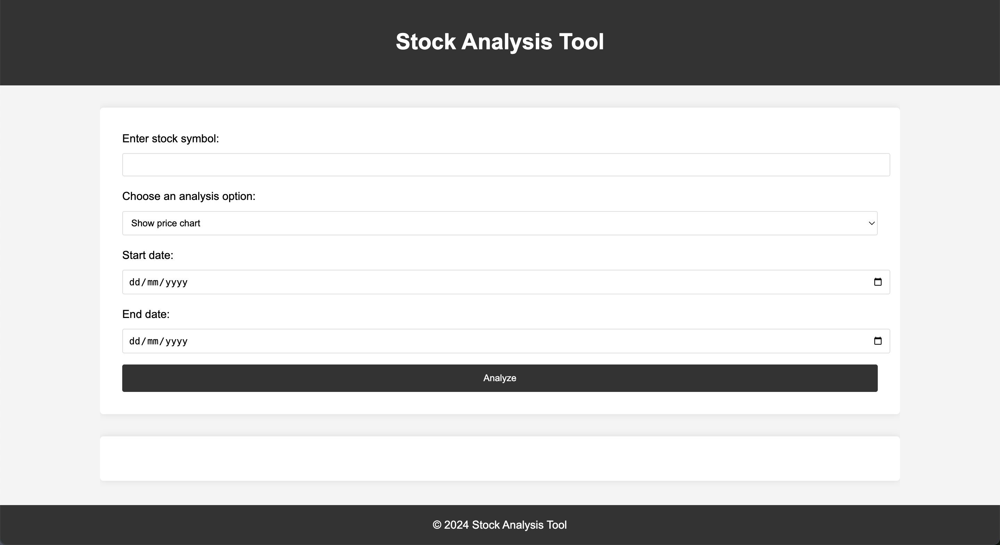
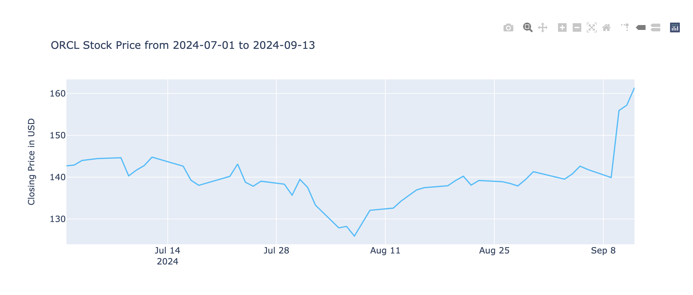
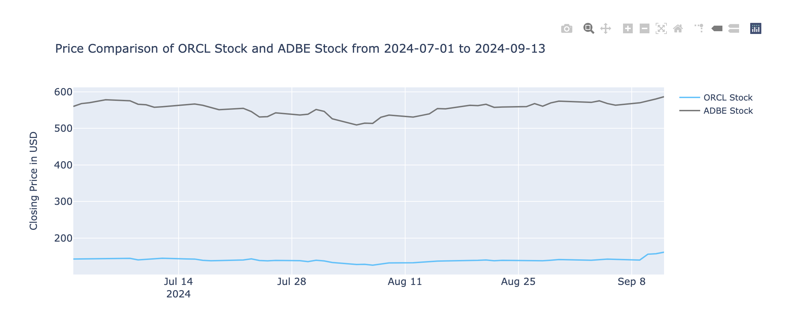
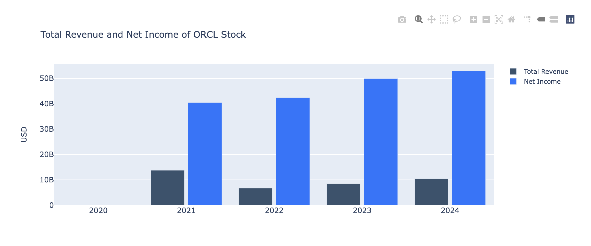
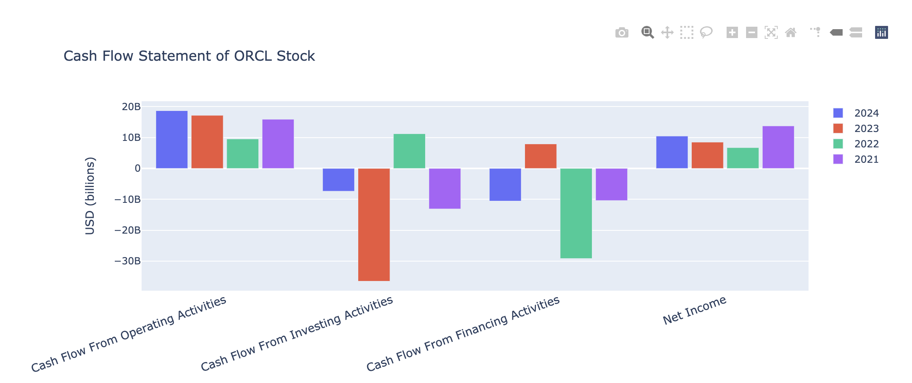
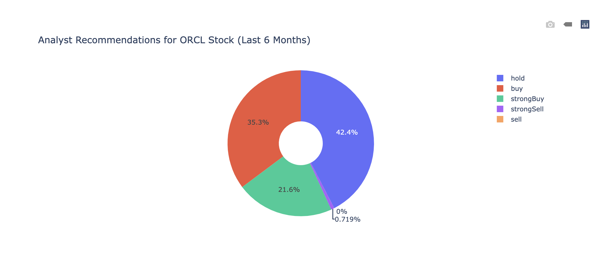
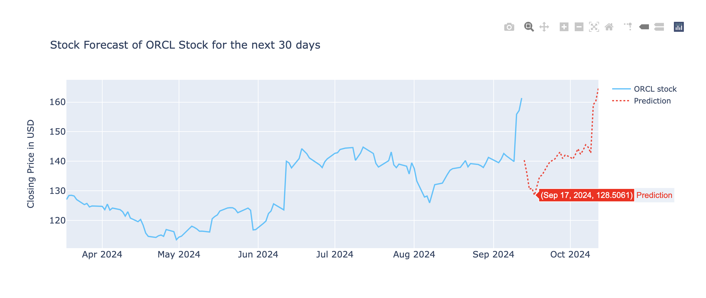

<h1 align="center">Stock Analysis using Yahoo! Finance </h1>

This Python-based project provides a tool to visualize and analyze stock data using the Yahoo! Finance database. Users can perform various stock analysis tasks, including displaying price charts, comparing stock prices, reviewing earnings and cash flow statements, viewing analyst recommendations, and predicting stock prices for the next 30 days. The project is built by Flask framework and requires relevant libraries for execution.
### <b>Key Feature</b> 
1. Display stock price charts
2. Compare prices between two stocks
3. View earnings, revenue, and cash flow statements
4. Analyst recommendations overview (last 6 months)
5. Price prediction using linear regression

  
You can find look up for company stock symbol in https://finance.yahoo.com/lookup/ 

##
### How to Run

- Install the requirements: `pip install -r requirements.txt`

- Go to this app's directory and run `flask --debug run`

### Option 1: Show price chart.
<i>e.g. Visualizes the price of ORCL with time selection from 2024-07-01 to 2024-09-13 in an interactive graph. </i>    

### Option 2: Compare Stock Price .
<i> Allows users to compare two stocks in specific timestamp, e.g ORCL & ADBE </i>    

### Option 3: View earnings and net income statements
<i> Displays stock’s earnings and revenue for the last 4 years as a bar chart, helping to analyze its financial performance. </i>    

### Option 4: View cashflow statements.
<i> Presents a bar chart of stock’s cash flow statement over the past 4 years</i>    

### Option 5: Analyst Recommendations.
<i> AShows a pie chart of analyst recommendations for stock over the last 6 months, categorized into buy, hold, sell, etc. </i>    

### Option 6: Price Prediction.
<i> Predicts stock price for the next 30 days using a linear regression model based on its past 10 years performance​</i>    

